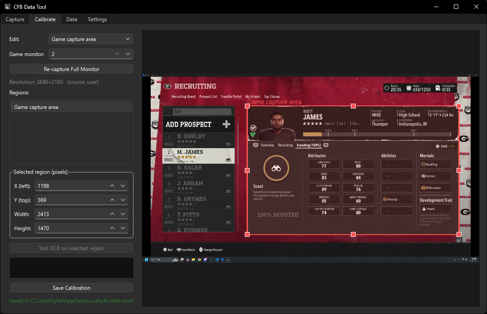
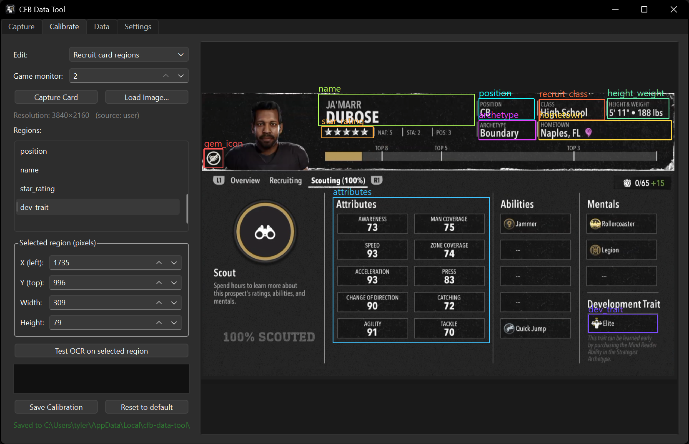
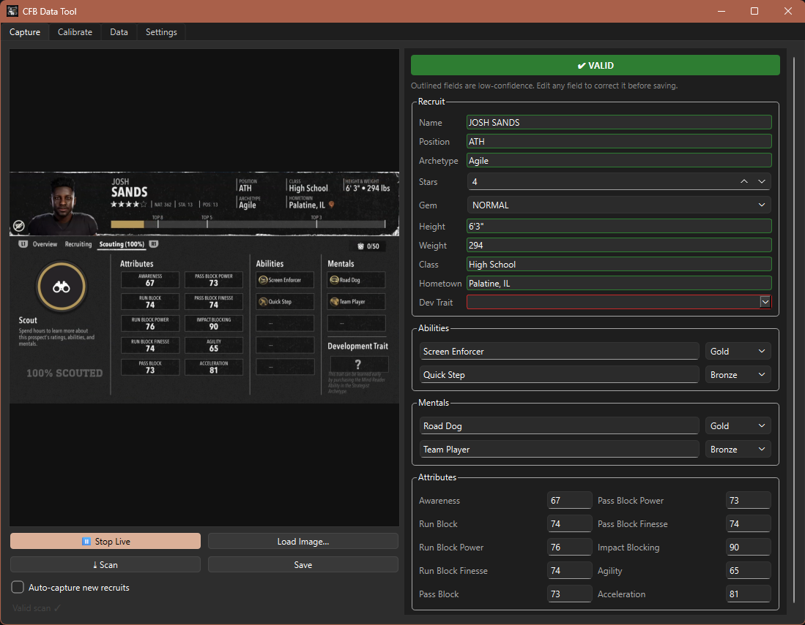
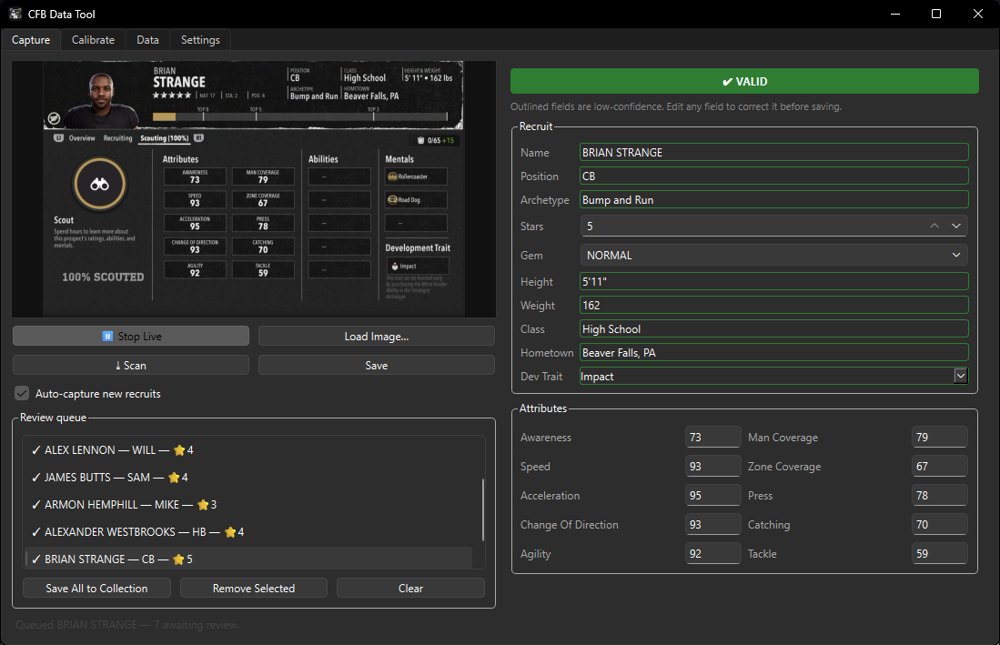
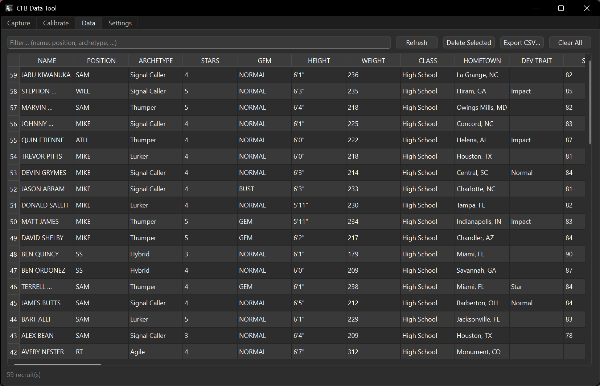
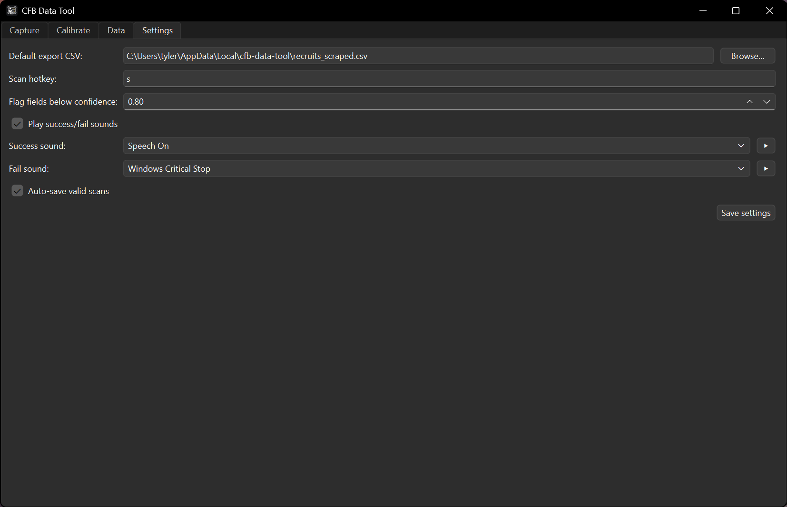

# 🏈 CFB Data Tool — Quick Start

A friendly guide to capturing recruit data from College Football. No terminal, no setup files — just install and go.

---

## 1. Install

1. Download **`CFBDataTool-Setup.exe`** from the [Releases page](https://github.com/patches822/cfb-data-tool/releases).
2. Double-click it → **Next → Next → Finish**. No admin password needed; it installs just for you.
3. Launch **CFB Data Tool** from the Start Menu or the desktop shortcut.

> Windows SmartScreen may warn about an unrecognized app (it's new and unsigned). Click **More info → Run anyway**.

The first launch takes a few seconds while the text-recognition engine loads.

---

## 2. Tell it where the game is (one-time calibration)

The tool reads recruit info straight from your screen, so it needs to know **where the recruit card is**. You only do this once.

1. Open the **Calibrate** tab.
2. Set **Edit:** to **"Game capture area"** and pick the **Game monitor** the game is on.
3. With a recruit's card open in the game, click **Re-capture Full Monitor**.
4. **Drag the box** so it covers the recruit card. 
5. Switch **Edit:** back to **"Recruit card regions"**. You'll see labeled boxes over each piece of info (Name, Position, Stars, …).
6. If any box is off, click its name in the **Regions** list, then drag/resize it to fit. Use **Test OCR on selected region** to check it reads correctly. 

Your calibration saves automatically when you leave the tab. (Different resolutions are remembered separately.)

---

## 3. Capture recruits

Open the **Capture** tab and click **Start Live** — you'll see a live thumbnail of the card.

**One at a time:** hover a recruit in-game and press your **scan hotkey** (default `S`), or click **Scan**. The recruit appears on the right with every field. Anything the tool is unsure about is **outlined** — click and fix it, then **Save**. 

> **No game handy?** Click **Load Image…** to test with a saved screenshot.

**Hands-free (auto-capture):** tick **Auto-capture new recruits**. As you scroll through recruits in-game, each new card is scanned into a **Review queue**. When you're done, review the list (remove any duplicates with **Remove Selected**), then **Save All to Collection**. 

---

## 4. View & export your data

The **Data** tab is your collection — sortable and filterable. Re-scanning a recruit updates their row instead of duplicating it.

- Type in the filter box to find recruits.
- Click a column header to sort.
- **Export CSV…** to open your recruits in Excel or Google Sheets. 

---

## 5. Settings worth knowing

- **Default export CSV** — where CSV exports land when you click **Export CSV** in the Data tab.
- **Scan hotkey** — click the field and press the key you want. Changes take effect after a restart.
- **Flag fields below confidence** — OCR fields scoring below this threshold (default 0.80) are highlighted for review.
- **Success / fail sounds** — pick any Windows sound (or your own `.wav`), with a ▶ preview.
- **Auto-save valid scans** — save good manual scans without clicking Save.

---

## Troubleshooting

| Problem | Fix |
| --- | --- |
| Live preview is black or wrong | Re-do the **Game capture area** step; make sure the right **Game monitor** is selected. |
| A field reads wrong | Calibrate that region (drag the box, use **Test OCR**). You can always fix a value before saving. |
| Auto-capture double-scans or misses | Use **Remove Selected** in the queue for duplicates; let cards fully settle before scrolling. |
| No sound | Check Windows volume/System sounds; pick a different sound in Settings and hit ▶. |

---

This tool reads pixels from your own screen only — it does not modify the game or access game memory. Not affiliated with or endorsed by Electronic Arts.
